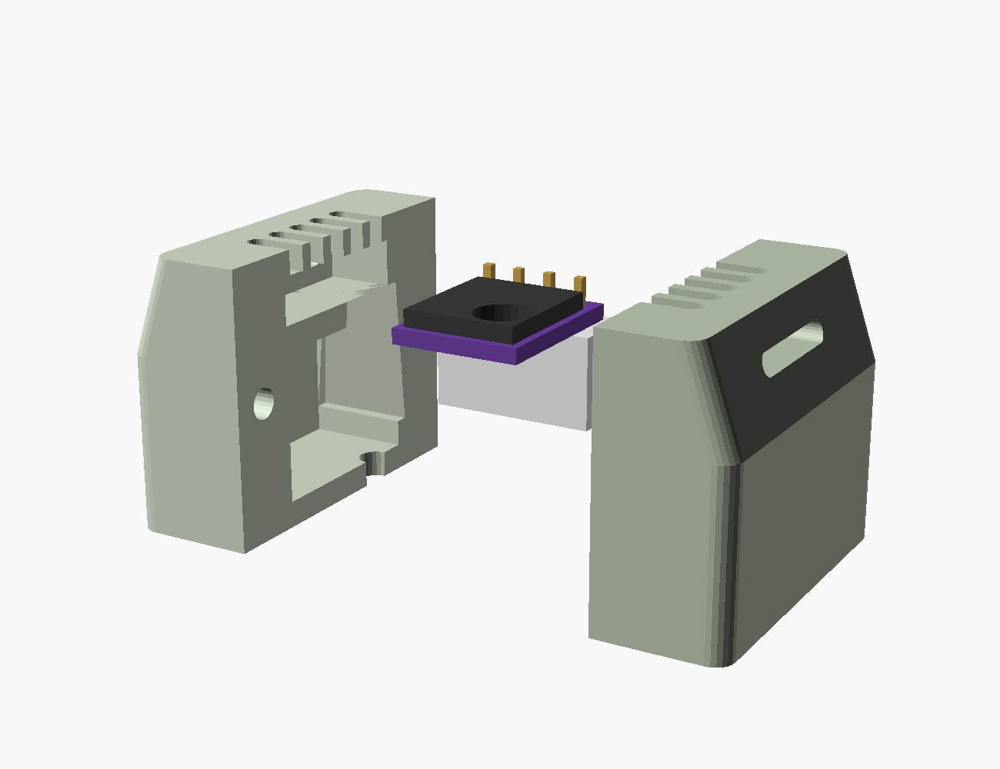
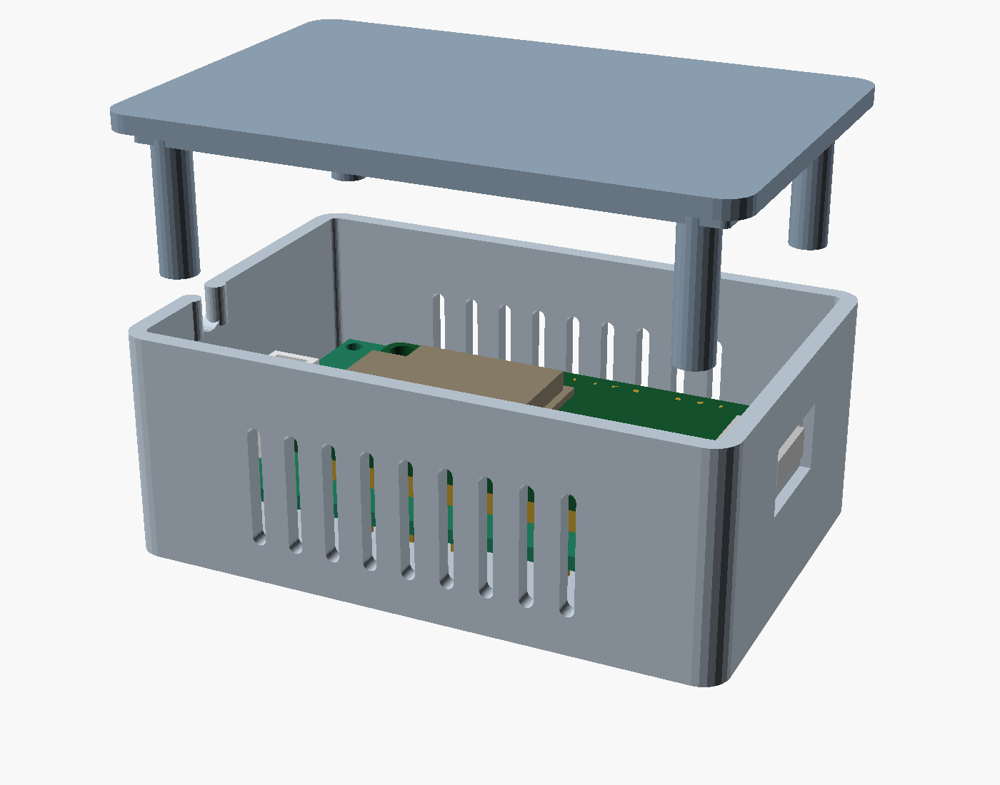

# Enclosure design plan

Three complete units, one per room. Each unit is **two printed enclosures on a
short pigtail**: an MCU box and a sensor pod. The boards are built and will not
be modified, so every dimension here is a consequence of
[`hardware/params.scad`](../hardware/params.scad), not a free choice.

| Unit | Location | MCU box | Sensor pod |
| --- | --- | --- | --- |
| A | Utility room | screwed to the side of a cabinet | hangs below the box on the pigtail |
| B | Sunroom | discreet, sits at the base of the LEGO orchid's pot | styled as a leaf / unbloomed bud |
| C | Living room | freestanding on a bookshelf | short stub arm off the box, front edge |

## The one constraint that drives everything

**The BME280 cannot share air with the WROOM.** A WROOM-32 with Wi-Fi up
self-heats enough to bias temperature by several degrees, and relative humidity
follows the temperature error. That is why there are two enclosures and not one
box with a divider - a divider still shares the wall, and 3D-printed plastic
conducts well enough to matter at these deltas.

Three rules follow, and they are non-negotiable in every variant:

1. **The pod is a separate volume on a pigtail**, 10-20 cm, per the decision
   made for this design.
2. **The pod is never directly above the MCU box.** Warm air off the box rises;
   put the pod level with it or below, and offset laterally. Unit A hangs the
   pod below the box for exactly this reason.
3. **The pod is vented top and bottom** so it convects, and the BME280 can
   itself sits in the airflow rather than behind a wall.

## Architecture: one family, swappable mounts

Do not design three enclosures. Design **one MCU box and one pod**, each with a
mount interface, and make the three locations three small adapter parts.

```
hardware/
  enclosure_common.scad     shell / lid / boss / vent-slot library, no dimensions of its own
  enclosure_mcu.scad        part = "base" | "lid" | "check"
  enclosure_sensor.scad     part = "base" | "lid" | "check";  style = "plain" | "bud"
  mounts.scad               part = "cabinet" | "shelf" | "orchid"
  fitgauge.scad             printed first, before any enclosure
```

The mount interface is a **dovetail or two-screw pad on the MCU box's back
face**, identical across all three, so a unit can be moved between rooms by
reprinting a 5 g adapter instead of the box. Adding this costs almost nothing
now and is very expensive to retrofit.

Every new dimension goes in `params.scad` with a confidence tag, same as
everything else. `enclosure_common.scad` should hardcode nothing.

## MCU box

### The envelope, from the model

`make assembly` echoes these; they are not estimates.

| | |
| --- | --- |
| Board | 60.00 x 40.00, mounted on its four corner holes, **M2 only** |
| Mount pattern | 56.34 x 36.02 |
| Above the wiring face | **13.20** - the mated connector, not the ESP32 |
| ESP32 stack top | 8.84 - 4.4 mm of headroom under the connector's number |
| Below the wiring face | **4.36** - untrimmed ESP32 header tails, plus the wiring itself |
| Total board-to-board | 17.56 |
| USB-C | -X end, stands **3.31 proud** of the board edge, window at Z = 5.74 to 9.00 above the wiring face |
| ESP32 PCB overhang | 1.56 past the -X board edge, under the USB port |

Interior floor-to-lid is therefore **~13.2 + standoff + margin**, and the
standoff must clear 4.36 of pin tails *plus* the wire runs on that face. Start
at **6.0 mm** standoffs and confirm on the real board - the wiring is hand-laid
and nobody has measured how proud it sits.

### The cable exit is the awkward part

The MCU connector is a **straight header on row 20** - the plug pulls
**straight up**, not sideways, and its face is 13.2 mm above the wiring face.
The cable then has to turn 90 degrees to leave the box. It also sits **7.62 mm
off the board centerline** toward column A (columns C..F), so the exit is *not*
on the box's midline. Two options:

- **Side exit at the +X wall** (recommended). Needs the interior to run to
  roughly 13.2 + one cable bend radius above the board, call it 22-24 mm, with
  a slot in the +X wall at the top. Only 5.87 mm separates the connector center
  from the board edge, so the bend is tight - measure the cable's real minimum
  radius before fixing this.
- **Top exit straight through the lid.** Shortest possible box, but the cable
  stands off the lid, which rules it out for the cabinet mount and looks wrong
  in the sunroom.

Whichever is chosen, **allow `xh_solder_tilt` (5 deg)** at the exit and around
the plug. The built connectors are visibly askew; a slot sized for a
perpendicular plug will bench-test fine and then refuse to close.

USB-C exits the **opposite** (-X) wall, so the two openings never interact.
Cut the USB window oversize - `usb_overhang` at 1.75 is flagged in `params.scad`
as the single highest-risk number in the project - and relieve the outside face
so a chunky USB-C overmold can seat.

### Construction

- Tub + lid. Print the tub open-side-up and the lid face-down: no supports
  anywhere, and the only bridge is the top edge of the USB-C window.
- Vent slots in the walls only, vertical, 1.6 mm (4 nozzle widths) so they
  bridge cleanly. The MCU box vents to keep itself cool; it does **not** need
  to be sensor-grade.
- Do not design a snap-fit lid first - snap fits need a tuned clearance, and
  `clearance` is still `[EST]` at 0.20.

### How it fastens: one screw per corner

The obvious scheme - four screws for the board, four more for the lid - does
not fit. The board is 60 x 40 in an interior that is 63.5 x 40.4, and its
corner holes sit ~1.9 mm from the edges, so the four corners are the *only*
place a post can stand and the board is already using them. Widening the box
to make room for separate lid posts costs ~10 mm across.

So one screw does three jobs:

```
   M2 x 16, head counterbored into the OUTSIDE of the floor
     |  up through the standoff tube        (clearance)
     |  through the perfboard's corner hole (2.2 mm, clearance)
     +->into a post hanging off the lid     (tapped, 6 mm engagement)
```

The lid posts drop into the board's corner holes as the lid closes, so the lid
also **locates** the board. The heads end up on the outside of the floor, which
is where a mount adapter gets captured later without adding fasteners - at the
cost of ~2 mm more screw length per adapter.

Two consequences:

- The screws are on the bottom, so a wall-mounted unit comes off its keyholes
  before it can be opened. For a sensor that is opened once a year, that is the
  right trade.
- `enc_post_od` is **not a free choice**. At the -X/+Y corner the ESP32's own
  PCB edge is 2.49 mm from the screw axis, so the post is 4.20 mm and clears
  the board it is holding down by **0.39 mm**. Widening it collides. There is
  an `assert()` on exactly this.

## Sensor pod

The board is 13 x 10 and ~2.5 thick, and it is not what sets the size. The
**connector straddles the board** - mated plug 11.6 mm off the trace side,
components and pin tails 3.4 on the other - and the plug's housing is 12.52 mm
wide against a 10 mm board. The pod comes out **26.6 x 19.6 x 21.2** and every
millimetre of that is the connector.

`hardware/enclosure_sensor.scad`, two clamshell halves, built and manifold with
an empty check. Not printed.



### Why a clamshell and not a tub and lid

The interconnect has a housing on **both** ends - both boards carry male
headers - so the cable cannot be threaded through a closed hole, and a hole big
enough to pass a plug is most of the pod's end face. The exit therefore has to
be split between the two halves, which puts the parting plane through the cable
axis. That decision then pays for itself twice over: the halves close sideways
onto the board, so nothing has to be inserted along Z, and the cable gland is
just a half-round in each half that clamps the cable when the screws go in.

### The board is held by the connector, not by a screw

The board's single mounting hole is `[EST]` and its Y sign is
**mirror-ambiguous** - read off a bottom-side photo, so a boss built on it
could land 4 mm out on a 10 mm board. Nothing in this pod uses it, and nothing
here is blocked on that photo.

The connector does the work instead, because it is soldered to the board and
its top face is flush with the board's underside at Z = 0:

- **above Z = 0** the cavity is the *board's* outline only, so shell material
  stands over the connector's flange - it overhangs the board by 1.26 mm each
  side and 0.85 mm past the end - and stops the assembly lifting;
- **below Z = 0** the cavity is the *connector's* outline only, so shell
  material remains under the board out to x = 1.10 and holds it up.

Two boxes, and the board is located in X, Y, Z and rotation with no fastener
through it. It only works because the halves close laterally - a tub and lid
would need insertion clearance in Z and would lose the shoulder. Three
`assert()`s guard it; if any fails the board is loose and the render still
looks perfect.

### The plug pocket leans

`xh_solder_tilt` is finally load-bearing rather than a note. The pocket tapers
**2.03 mm** wider over the plug's depth, so a connector soldered up to 5 degrees
off square still seats. A pocket cut for a perpendicular plug is the classic
way to end up with a pod that will not close, and this one is deep enough
(11.6 mm) for 5 degrees to matter. The taper leans toward the +X screw as it
deepens; there is 1.26 mm left between them, and an assert that says so.

### Venting

- A **grille of 5 slots directly over the sensor**, 48% open, with 2 mm of wall
  between it and the BME280's can.
- One **cross-flow slot** through both side walls, level with the can, so air
  crosses the chamber instead of sitting in it.

The outer shell tapers - narrow over the sensor, full width over the plug. That
is not styling: it is what gets the chamber's side walls down to 2 mm so the
cross-flow slot is a slot and not a 5 mm tunnel.

### Printing

Each half lies on its parting face, open side up. In that orientation **every
internal feature is vertical - there is not one overhang in the part**. The only
sloped surface is the outer taper, at 25 degrees off vertical. This is the
single biggest advantage of the clamshell over a tub and lid, and it was not
the reason for choosing it.

### Still to come for the sunroom

Unit B wants a **double-wall shell** over this one - an outer decorative skin
with an air gap - because sun on a pod reads as a temperature spike that has
nothing to do with the room. That is a miniature Stevenson screen wearing a
flower costume, it wraps the pod rather than replacing it, and it is M5.

## The three variants

### A - utility room, cabinet side

MCU box gets a **flanged back with two keyhole slots** so it drops onto two
pan-head screws already in the cabinet side, then a third screw locks it. Box
vertical, USB-C down so the power lead falls naturally and dust does not settle
in the port. Pod hangs **below** on the pigtail in a plain vented shell, either
free on the cable or clipped to a small bracket 10-15 cm down.

### B - sunroom, LEGO orchid

Two parts, deliberately different in character:

- **MCU box**: low and flat, sitting at the base of the pot, in a colour that
  disappears against it. No LEGO geometry - the orchid model does not offer a
  good attachment, so the box just sits. Cable exits toward the plant.
- **Sensor pod as a leaf or unbloomed bud**: an organic outer shell whose seams
  *are* the vents - louvres reading as leaf veins, or a bud whose petal gaps are
  the airflow path. It hangs or perches among the real LEGO leaves at pot
  height, which is also the height worth measuring in that room.

Print unit B in **PETG, not PLA**. A sunroom behind glass gets near PLA's glass
transition, and a drooping enclosure in a plant is a hard failure to diagnose.

This variant needs the orchid photographed with a scale reference before its
shell is drawn - see below.

### C - living room, bookshelf

Freestanding, so the box carries its own **foot**: stand it on a long edge with
a weighted or wide base so it reads as an object rather than a naked box.
Book-adjacent proportions hide it best. The pod goes on a **short stub arm** off
the front edge so it sits out past the shelf lip and out of the box's thermal
plume, rather than dangling.

## Verifying fit before printing

Two mechanisms, both cheap:

1. **`part = "check"`** in each enclosure file: `intersection()` of the shell
   with the assembly's keepout solids (`esp32_keepout()`,
   `perfboard_keepout()`, `xh_mated_keepout()`). A correct design renders
   **empty**. Anything visible is a collision, found in seconds instead of in
   PLA. This is the natural extension of the `assert()` discipline already in
   the models - asserts catch numbers, this catches geometry.
2. **The fit gauge, printed first**, per the last section of
   [measuring.md](measuring.md). Extend the existing idea to carry, at
   -0.30/-0.15/0/+0.15/+0.30: the USB-C window, an M2 boss, a perfboard corner
   seat, and the cable exit slot. Whatever offset actually fits becomes
   `clearance` in `params.scad`, and every later part inherits a measured
   number instead of a guessed one.

## Measurements still needed

In priority order. Item 1 blocks printing; 2 blocks unit B's shell only.

1. **The mated plug and its cable**: plug body width and depth, cable outer
   diameter, and how tightly it will actually bend. There is no measured number
   for any of it, and it now sets three things - the MCU box's interior height,
   its cable exit, and the pod's gland, which clamps the cable directly and is
   the one feature that fails outright if `cable_od` is wrong.
2. **The LEGO orchid**, photographed with a 2x4 brick (31.8 mm) in frame:
   pot dimensions, leaf scale, and where a pod could plausibly perch.
3. **The cabinet side** - can it be drilled, or does unit A need adhesive
   mounting instead? Different back geometry either way.
4. **M2 hardware on hand**: every fastener in the project is now an **M2 x 16**,
   four in the MCU box and two in the pod. Confirm that length is available
   before printing anything.

**No longer blocking:** a flat photo of the sensor board was going to be needed
before the pod could be designed, because the mounting hole is `[EST]` and
mirror-ambiguous. The pod does not use that hole, so the photo is now only
worth taking to firm up `bme_pcb_thick` and the outline - neither of which the
design is sensitive to.

## Order of work

| | |
| --- | --- |
| M0 | Take photos 1-3; add the enclosure block to `params.scad`, tagged. **Params done; photos outstanding** |
| M1 | Print the fit gauge; replace `clearance = 0.20 [EST]` with a measured value |
| M2 | MCU box v1, plain, no mount. **Drafted - see below.** Fit the real board; iterate the cable exit |
| M3 | Sensor pod, plain vented. **Drafted.** Fit the real sensor board |
| M4 | Three mount adapters; print unit A and unit C |
| M5 | The bud/leaf shell for unit B, in PETG |
| M6 | ESPHome config, then check all three against one reference thermometer in one room before they are dispersed |

M6 is not optional. Three sensors that disagree by a degree are three sensors
you cannot trust; measure the offsets while they are still on the same table.

## The MCU box as drafted

`hardware/enclosure_mcu.scad`, built and manifold, collision check empty. Not
printed yet - every number below is a model, not a measurement.

| | |
| --- | --- |
| Exterior | **67.5 x 44.4 x 27.6 mm** |
| Interior | 63.5 x 40.4 x 23.2 |
| Board sits | 6.0 mm above the inner floor, 17.2 below the rim |
| Fasteners | 4x **M2 x 16**, from below |
| Lid post clearance to the ESP32 | 0.39 mm |
| USB-C shell face | 0.45 mm inside the outer wall - hence the relief pocket |



Two details in the render that look like mistakes and are not: the cable exit
is off the box's midline, because the connector sits on columns C..F rather
than centered; and the box is much deeper above the board than below, because
the mated plug is 13.2 mm tall while the ESP32 stack is only 8.84.

### Still soft in this draft

- `enc_standoff_h = 6.00` clears the 4.36 mm of header tails, but the
  hand-laid wiring on that face has never been measured. First thing to raise
  if the board will not sit flat.
- `enc_cable_head = 4.00` is a stand-in for a bend radius nobody has measured.
- `usb_plug_w/h` - the relief pocket is sized for a guess at the overmold.
- All three belong on the fit gauge.

## What `make check` is and is not good for

It intersects each enclosure with the hardware keepouts and must print
`Current top level object is empty`. Both do. It has now been run in anger on
both ends, and the record is worth keeping honestly:

**What it caught.** Nothing structural in the MCU box - but writing it forced a
correction. The first run reported eight collisions, all of them standoff tops
and post bottoms, i.e. the surfaces that are *supposed* to touch the board. A
keepout that forbids the clamping scheme reports the design as broken by design,
so both checks now exempt exactly the intended bearing surfaces and nothing
else: a ring at each corner hole in the box, the Z = 0 plane in the pod.

At the sensor end it caught a real error, though in the keepout rather than the
pod: `sensor_keepout()` padded the connector's pin tails out by a whole pitch,
making them 10.56 mm wide on a **10 mm board** - impossible, and it would have
flagged any pod built correctly to the board. Sized from the pin row itself now.

**What it missed.** Three real defects, all found by rendering the part and
looking at it:

1. The MCU cable exit was cut to the same height in the lid as in the tub, so
   the channel was open at the top and the cable would lift straight out.
2. The strain-relief ribs sat inside the `difference()`, so the notch erased the
   very bumps meant to pinch the cable.
3. The pod's cross-flow slot originally ran into the chamber ceiling, leaving a
   zero-thickness sliver.

None is a clearance violation, so no keepout could have found any of them. The
check proves parts do not interpenetrate. It says nothing about whether they do
their job.

**One quirk worth knowing.** The pod's cavity is the board plus exactly
`clearance`, so at the full value every cavity wall is coplanar with a keepout
face and CGAL returns a zero-facet artifact rather than an empty set -
indistinguishable at a glance from a real hit. The pod's check asks for ten
microns less, which is the same question with a clean answer.

## Risks

- **`usb_overhang` (1.75, `[PHOTO]`)** - flagged in `params.scad` as the highest
  risk number in the project. The fit gauge retires it.
- **Cable bend radius is unmeasured** and sets the MCU box height. The side-exit
  design falls back to the top exit if the cable turns out to be stiff.
- **`cable_od` (3.00, `[EST]`)** is now the riskiest number in the project. The
  pod's gland clamps the cable at `cable_od - 0.4`; if the real cable is much
  fatter the halves will not close, and if it is much thinner there is no strain
  relief. Measure it before printing a pod.
- **The pod's retention depends on `bme_conn_inset` (1.50, `[EST]`)**, which
  sets how far the connector overhangs the board and therefore how much flange
  the shoulder has to bear on. At 1.06 mm a side there is room to be wrong, but
  not much.
- **Thermal validation is empirical.** The vent design is a reasoned guess. M6
  is what tells you whether the pod actually reads room air, and the fix if it
  does not is a longer pigtail, which is why the connector is there.
